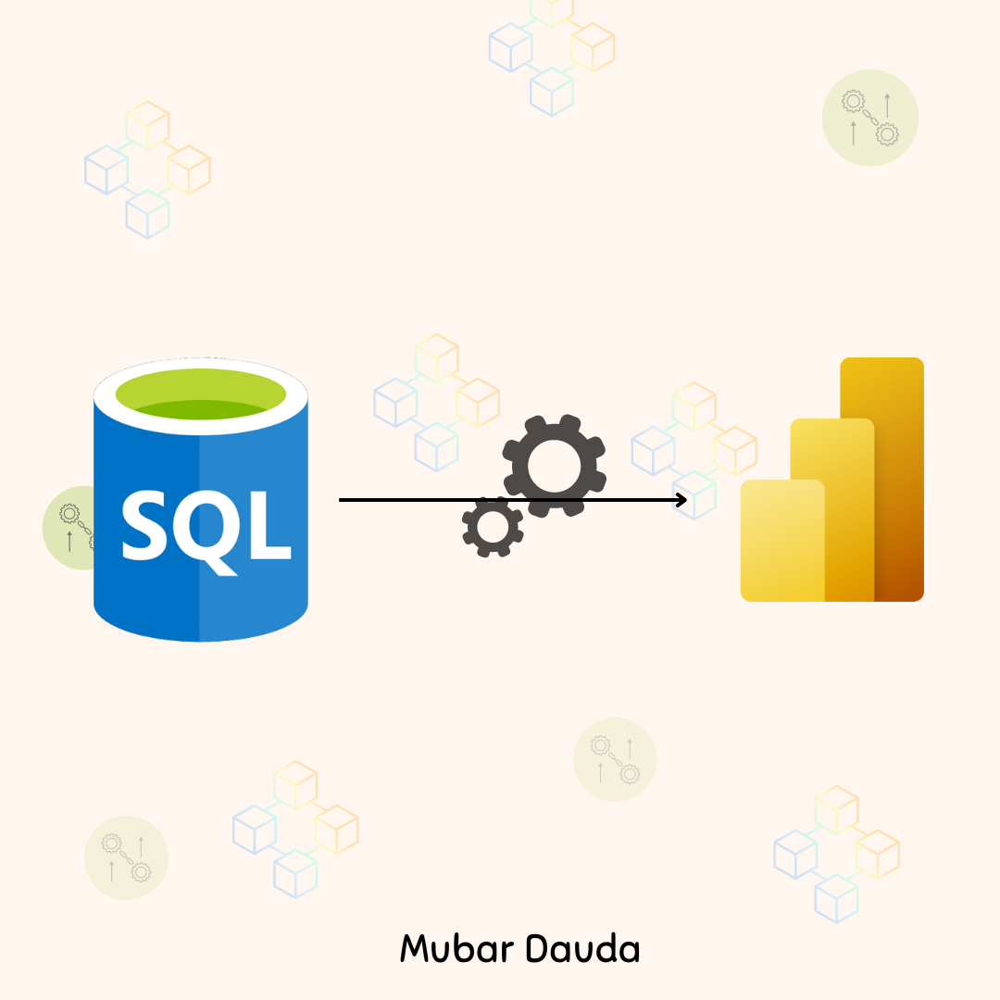
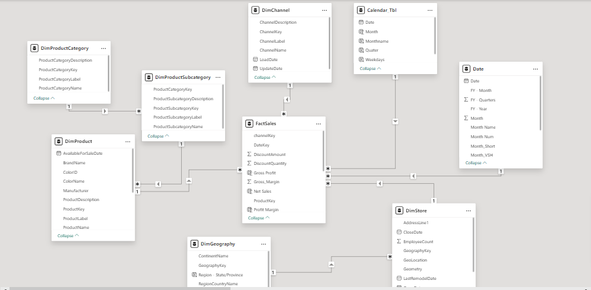
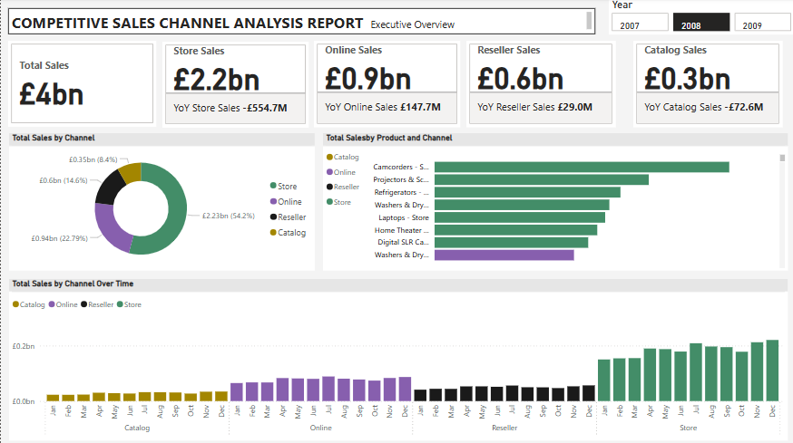
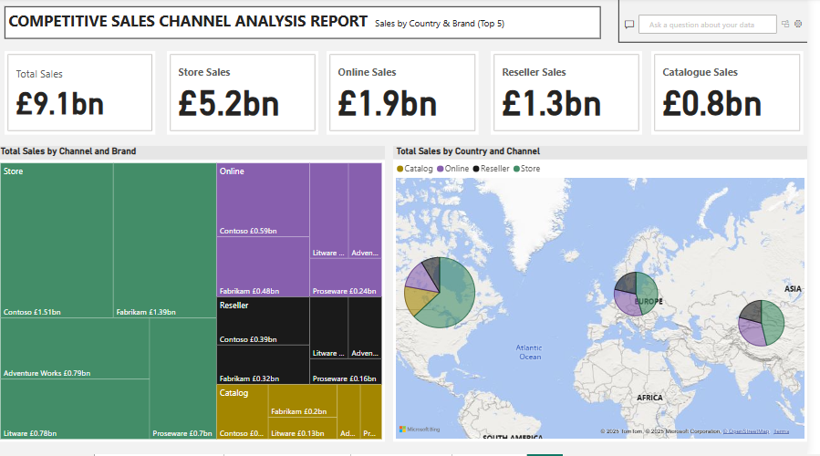
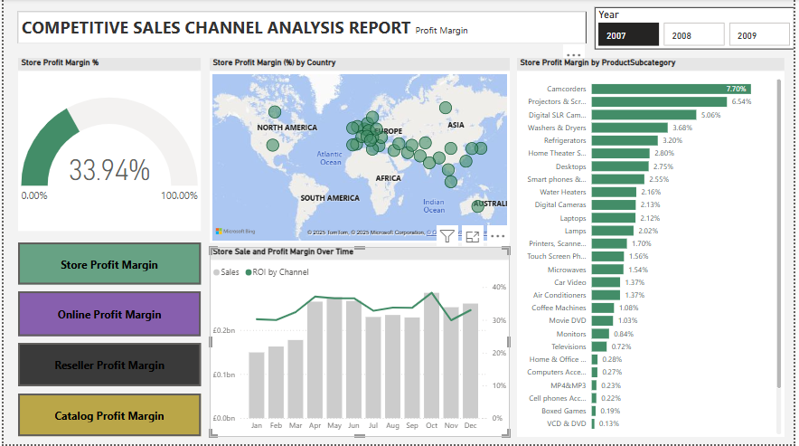

# Microsoft SSMS Database to Power BI Desktop & Service

## Contoso Retail: Competitive Sales Channel & Marketing Analysis



# Table of Content
- [Project Title](#Project-Title)
- [My Role](#My-Role)
- [Project Overview](#Project-overview)
- [Problem Statement](#Problem-statement)
- [Stakeholder Engagement](#Stakeholder-Engagement)
    - [Target Stakeholder](#Target-stakeholder)
    - [Use Cases](#Use-cases)
    - [Stakeholders Stories](#Stakeholder-stories)
    - [Acceptance Criteria](#Acceptance-criteria)
    - [Success Criteria](#Success-criteria)
- [Data Source](#Data-source)
  - [Dataase Structure](#Access-Database-Structure)
  - [Access Database Benefit](#Benefit-of-Access-Storage)
- [Methodology](#Methodology)
  - [Tool used](#Tool-Used)
  - [Development](#Development)
      - [Project Planning & Requirement Gathering](#Project-Planning-&-Requirement-Gathering)
      - [Data Sources Setup and Access](#Data-Sources-Setup-and-Access)
      - [Data Exploration & Profiling](#Data-Exploration-&-Profiling)
      - [ETL Process Using Power Query](#ETL-Process-Using-Power-Query)
      - [Data Modelling](#Data-Modelling)
      - [Measures Development Using DAX](#Measures-Development-Using-DAX)
      - [Dashboard Design & Visualisation](#Dashboard-Design-&-Visualisation)
          - [Mock up Design](#Mukkup_design_Dashboard)
      - [Publishing and Collaboration](#Publishing-and-Collaboration)
      - [Documentation & Version Control](#Documentation-&-Version-Control)
      - [Review & Iteration](#Review-&-Iteration)
- [Detailed Insights and Recommendations](#Detailed-Insights-and-Recommendation)
  - [Dashboard 1](#Sales-Pulse-Performance,-Frequency-&-Return-(Executive-Overview))
  - [Dashboard 2](#Sales-Performance-&-Customer-Behaviour-(Net-sales-by-Customer-Demographic))
  - [Dashboard 3](#Product_portfolio-performance-(Based-on-Gross-Proft))
 
# Project Title:
Contoso Competitive Sales Channel Analysis

# My Role
Power BI Developer/Data Analyst  

  - Designed the relational data model in Power BI through direct query option to  Microsoft SQL Server Management Studio data sources.
  - Developed Power BI dashboard for executive decision-making marketing and sales channel strategy.
  - Created advanced DAX measures for sales, margin, and trend analysis
  - Conducted ETL and data cleansing with Power Query
  - Delievered insights into channel Profitability, product performance, and geographic sales behavior

# Project Overview  

This project analyses Contoso’s multi-channel retail operations (Store, Online, Reseller, Catalog) to uncover sales trends, profit margins, and geographic performance using a SQL-based backend. Interactive Power BI dashboards support executive-level decisions regarding marketing strategy, resource allocation, and inventory planning.

# Problem Statement

Contoso lacked clear visibility into how different sales channels, products, and regions performed over time.
Key business questions included:  

- Which sales channels drive the most revenue and profit?
- What are the most profitable product subcategories?
- How do sales and margins differ by region and time period?  

This project resolves these issues by delivering a suite of Power BI dashboards with intuitive visualizations and actionable metrics.

# Stakeholder Engagement
### Target Stakeholder

- Executives (Sales, Marketing, Finance)
- Regional Managers
- Product Strategy Teams

### Use Cases

- Sales channel analysis that identify channels KPI's highlighting Total sales with YoY channel performance, breakdown products across all channel and monthly sales trends of across each channel.
- identifying top performing Brand name for each sale channel, what sales products contributed to it, and brand name performance across sales location.
- Localise marketing based on regional sales behavior
- Evaluate channel-specific ROI and margin performance

### Stakeholder Stories

- "As a Channel Manager, I need to see which channels are underperforming YoY so I can act quickly."
- "As a Marketing Head, I want to know which products have the best margins in each region."
- "As an Executive, I need to see overall sales, profitability, and performance trends in one dashboard."

### Acceptance Criteria

- Clear display of KPIs: Overall and top 5 brand Total Sales, Profit Margin, YoY Changes
- Filters for year, region, channel
- Channel-level breakdowns of product performance and margin
- Geo-mapping and trend visuals
- channels Bookmark button to interchange insights visual chanel profit, trends of sales and profit margin and product subcategory breakdown.

### Success Criteria

- Senior stakeholders can make informed, strategic decisions
- Analysts gain self-service access to performance metrics
- Marketing campaigns are aligned with profitable regions/products
- Product teams reduce inventory waste through data-backed insights

### Data Source

### Microsoft SQL Server Management Studio (SSMS) Structure  

    ## Add a picture of each table and ERD diagram, but mainly picture of tables that was used.

#### Fact Table
- FactSales Table: ChaneelKey, DateKey, DiscountAmount, DiscountQuantity, Gross Profit, Gross-Margin, Net Sales, ProductKey, Profit Margin, ReturnAmount, ReturnQauntity, Sales, SalesQuantity, StoreKey, Subcategory_Channel, TotalCost, UnitCost, and UnitPrice.  

| Column Name | Data Type | Description |
| --- | --- | --- |
| SalesKey | Whole Number | Unique Identifier of each sales |
| DateKey | Date | Date of each sales |
| ChannelKey | Whole Number | Foreign key referencing channel table (ChannelKey) |
| StoreKey | Whole Number | (Delete) not needed |
| SalesKey | Whole Number | Unique Identifier of each sales |
| DateKey | Date | Date of each sales |
| ChannelKey | Whole Number | Foreign key referencing channel table (ChannelKey) |
| ProductKey | Whole Number | Forforeign key referencing product table (Productkey) |
| SalesKey | Whole Number | Unique Identifier of each sales |
| DateKey | Date | Date of each sales |
| ChannelKey | Whole Number | Foreign key referencing channel table (ChannelKey) |
| UnitCost | Fixed decimal number | Cost per product sold |
| UnitPrice | Fixed decimal number | unit price per product sold |
| SalesQuantity | Whole Number | qauntity of product sold |
| ReturnedQuantity | Whole Number | Quantity of product sold amount returned |
| ReturnedQuantity | Fixed decimal number | Returned Sold Amount |
| DiscountQuantity | Whole Number | qauntity of product that is being discounted |
| DiscountAmount | Fixed decimal number | amount on discounted qauntity |
| TotalCost | Fixed decimal number | cost of goods sold |
| Sales | fixed decimal number | products qauntity sales |
| Gross_Margin | Fixed decimal number | Difference between sales and total cost amount | 


#### Dimension Tables

- DimProductCategory Table: Including ProductCategoryDecription, ProductCategoryKey, ProductCategoryLabel, and ProductCategoryName.  

| Column Name | Data Type | Description |
| --- | --- | --- |
| ProductCategoryKey | Whole Number | Unique identifier for each Product Category |
| ProductCategoryLabel | Text | Deletd |
| ProductCategoryName | Text | Name of each product category |
| ProductCategoryDescription | Text | short note to decribe each product category |  


- DimProductSubcategory Table: ProductCategoryKey, ProductSubcategoryDescrition, ProductSubcategoryKey, ProductSubcategoryLabel, and ProductSubcategoryName.  

| Column Name | Data Type | Description |
| --- | --- | --- |
| ProductSubCategoryKey | Whole Number | Unique identifier for each Product Subcategory |
| ProductSubCategoryName | Text | Name of each product subcategory |
| ProductSubCategoryDescription | Text | short note to describe the product subCategory |
| ProductCategoryKey | Whole Number | Foreign key referencing  product category table (ProductCategoryKey) |  


- DimProduct Table: AvailableForSaleDate, BrandName, ColorID, ColorName, Manufacturer, ProductDescription, ProductKey, ProductLabel, and ProductName.  

| Column Name | Data Type | Description |
| --- | --- | --- |
| ProductKey | Whole Number | Unique identifier for each product |
| ProductLabel | Text | (Delete) not needed in this analysis |
| ProductName | Text | Name of selling product |
| ProductDescrition | Text | short note of product description |
| ProductSubcategory | Whole Number | Foreign key referencing product Product Subcategory (ProductSubcategoryKey) |
| Manufacturer | Text | Manufacturer of contoso products |
| BrandName | Text | products brand name |
| ColorID | Text | (Delete) not needed |
| ColorName | Text | (Delete) not needed |
| StockTypeID | Whole Number | (Delete) not needed |
| StockTypeNmae | Text | (Delete) not needed |
| UnitCost | Fixed decimal number | Cost per product sold |
| UnitPrice | Fixed decimal number | unit price per product sold |
| AvailableForSaleDate | Date/Time | (Delete) Date when product would be available for sale |
| StopSaleDate | (Delete) Date/Time | Date when product is stopped being sold |
| Status | Text | (Delete) not needed |  


- DimChannel: ChannelDescription, ChannelKey, ChannelLabel, ChannelName, LoadDate, and UpdateDate.  

| Column Name | Data Type | Description |
| --- | --- | --- |
| Channelkey | Whole Number | Unique Identifier of each channel |
| ChannelLabel | Text | (Delete) not needed |
| ChannelName | Text | name of each Sales channel |
| ChannelDescription | Text | short note to explain channel further  |
| LoadDate | Date/Time | (delete) not needed |
| UpdateDate | Date/Time | (delete) not needed |  


- DimGeography Table:  ContinentName, GeographyKey, Region-State/Province, RegionCountryName, StateProvinceName.  

| Column Name | Data Type | Description |
| --- | --- | --- |
| GeographyKey | Whole number | Unique identifier to DimGeopgraphy |
| ContinentName | Text | Continent of each customers |
| SateProvinceName | Text | store or customer Continent Name |
| RegionCountryName | Text | store or customer countryname |  


- DimStore Table: AddressLine1, CloseDate, EmployeeCount, GeographyKey, Geolocation, Geometry, LastRemodelDate, OpenDate, Satus, StoreKey, StoreManager, StoreNmae, and Storetype.  

| Column Name | Data Type | Description |
| --- | --- | --- |
| StoreKey | Whole Number | Unique Key Identifier of each store  |
| GeographyKey | Whole Number | Foreign Key referencing the Geograpgy table (GeographyKey)  |
| StoreManger | Whole Number | this a number that is attached to each manager |
| StoreType | Text | Available store type used for sales of goods  |
| StoreName | Text | Name of each store |
| Status | Text | This indicate if the store is still active or shutdown |
| OpenDate | Date/Time | Date the store will shutdown from dervices |
| ColseDate | Date/Time | Date the store was close for services |
| AdressLine1 | Text | Address to the sotres |
| EmployeeCount | Whole Number | Total number of employee for each store |
| GeoLocation | Text | Longitude and Latitude point of each store Location |
| Geometery | Text | longitude or latitude point of each store location |  


This table is not needed for now but for future purpose is would be needed so in that case while cleaning transforming data, the table would not be loaded in the report pane.  

#### Time Intelligence Date Table
- Date Table: Date, FY-Month, FY-Quarters, FY-Year, Month, Month Name, Month-Short, Month-VSH, Period, Quarter, and Year.  

| Column Name | Data Type | Description |
| --- | --- | --- |
| Date | Date | Full date of day/Month/Year and a unique identifier  |
| Year | Whole Number | Calendar year |
| Month | Whole Number | month number of calendar year |
| Month Name | Text | Month name of calendar name |
| Quarter | Whole Number | Quarter of calendar year |
| Month Short | Text | Uses the first three character of each month |
| Period |  Text | Combination of year and month of the year |
| FY - Month | Whole Number | Fiscal year month  |
| FY - Year | Whole Number | Fiscal year |
| FY - Quarter | Whole Number |  Fiscal year quarter |  

### Benefit of Microsoft SSMS Storage.

# Methodology  

### Tools Used
- Microsoft SQL Server Management Studio (SSMS):
SSMS was primarily used as a data storage and management tool. A DirectQuery connection was established from Power BI Desktop to the SQL Server database, allowing real-time querying of essential tables (e.g., FactSales, DimChannel, DimProduct, DimGeography, etc.). This approach ensured data freshness and reduced duplication during analysis.

- Power BI Desktop:
The main tool for creating the data model, writing DAX measures, and building interactive reports. It served as the development environment for all dashboards and calculations.

- Power Query:
Used within Power BI Desktop for the ETL process—cleaning, shaping, and transforming data after extraction via DirectQuery. Operations included column renaming, deleting unwanted columns, data type conversion, table joins, filtering, and calculated columns.

- Power Bi Service:
Dashboards were published to the Power BI Service for stakeholder access, real-time collaboration, and scheduled refresh management. The service also enabled dashboard sharing, mobile access, and usage monitoring.

- GitHub:
Used to host the documentation, project files (e.g., .pbix, .sql, .md), and provide public access for version control and portfolio presentation. It also served as a backup repository and platform to showcase the project in a professional setting.

### Development

General Approach to Creating the Solution:  

1. Project Planning & Requirement Gathering
2. Data Exploration & Profiling
3. Data Exploration & Profiling
4. ETL Process Using Power Query
5. Data Modelling
6. Measure Development Using DAX
7. Dashboard Design & Visualization
8. Publishing and Collaboration
9. Documentation & Version Control
10. Review & Iteration

#### Project Planning & Requirement Gathering

- Defined project scope and objectives (e.g., analyse sales channel performance,  product profitability, and geographical and sales trends).
- Identified key stakeholders (Sales, Marketing, and Executives) and gathered reporting requirements and KPIs.  
#### Data Source Setup and Access  

- Microsoft SQL Server was used to host the primary Contoso dataset.
- Connected Power BI Desktop to SQL Server using DirectQuery to enable real-time data access.
- Identified and extracted essential tables such as FactSales, DimChannel, DimProduct, DimGeography, and Date.

#### Data Exploration & Profiling  

- Reviewed data structures, row volumes, null values, duplicates, and relationships.
- Verified foreign key integrity across fact and dimension tables.
- Identified the appropriate grain of analysis (e.g., sales transactions per channel, date, and product).

#### ETL Process Using Power Query  

- Cleaned and transformed data using Power Query within Power BI Desktop.
- Applied business rules such as standardizing product labels, calculating derived columns (e.g., ROI, Net Sales), and removing unnecessary fields.
- Joined related tables for initial dimensional shaping.

#### Data Modelling  

- Built a star schema by establishing relationships between the fact table (FactSales) and relevant dimension tables.
- Ensured appropriate cardinality (e.g., many-to-one) and cross-filter directions.
- Added a dynamic date dimension for robust time intelligence.



From the above Power BI data model pane image above we can see that a many to one (*:1) was establish between the FactSales  (The Fact Table) and Dimensions Table (Product, Customer, and date table).The other tables shown are the Dax measure and measure documentation tables. 

#### Measure Development Using DAX  

- Created key DAX measures for KPIs: Total Sales, Profit Margin, YoY Sales, ROI, Gross Profit, etc.
- Used calculated columns and measures to support visuals requiring trend analysis, comparisons, and percentage breakdowns.

    ##### Here are some of the Dax measures created to enrich the project insights

```DAX
% Return_Quantity = 
 DIVIDE(
    SUM(FactSales[ReturnQuantity]),
    SUM(FactSales[SalesQuantity]),
    0
)
```
```DAX
% Total_Cost = 
DIVIDE(
    SUM(FactSales[TotalCost]),
    SUM(FactSales[Sales]),
    0
)
```
```DAX
Profit Margin = 
DIVIDE(
    SUMX(FactSales, FactSales[Gross Profit]), 
    SUM(FactSales[Net Sales]), 
    0
)
```
```DAX
Profit Margin = 
DIVIDE(
    SUMX(FactSales, FactSales[Gross Profit]), 
    SUM(FactSales[Net Sales]), 
    0
)
```
```DAX
Profit Margin % by BrandName = 
DIVIDE(
    SUM(FactSales[Gross Profit]), 
    CALCULATE(SUM(FactSales[Net Sales]), ALL(DimProduct[BrandName])), 
    0
)
```
```DAX
Profit Margin % by Channel = 
DIVIDE(
    SUM(FactSales[Gross Profit]), 
    CALCULATE(SUM(FactSales[Net Sales]), ALL('DimChannel'[ChannelName])), 
    0
)
```
```DAX
Profit Margin % by Product = 
DIVIDE(
    SUM(FactSales[Gross Profit]), 
    CALCULATE(SUM(FactSales[Net Sales]), ALL('DimProductSubcategory'[ProductSubcategoryName])), 
    0
)
```
```DAX
YoY Catalog Store = 
VAR CurrentYear = MAX('Date'[Year])
VAR PreviousYr = CurrentYear - 1
VAR CurrentSales = 
    CALCULATE(
        SUM('FactSales'[Sales]),
        'Date'[Year] = CurrentYear,
        'DimChannel'[ChannelName] = "Catalog"
    )
VAR PreviousSales = 
    CALCULATE(
        SUM('FactSales'[Sales]),
        'Date'[Year]= PreviousYr,
        'DimChannel'[ChannelName] = "Catalog"
    )
RETURN 
    CurrentSales - PreviousSales
```
```DAX
YoY Catalog Store (%) = 
VAR CurrentYear = MAX('Date'[Year])
VAR PreviousYr = CurrentYear - 1
VAR CurrentSales = 
    CALCULATE(
        SUM('FactSales'[Sales]),
        'Date'[Year] = CurrentYear,
        'DimChannel'[ChannelName] = "Catalog"
    )
VAR PreviousSales = 
    CALCULATE(
        SUM('FactSales'[Sales]),
        'Date'[Year] = PreviousYr,
        'DimChannel'[ChannelName] = "Catalog"
    )
RETURN 
    IF(
        PreviousSales <> 0,
        DIVIDE(CurrentSales - PreviousSales, PreviousSales),
        BLANK()  // This handles the scenario where there are no previous year sales to compare against.
    )
```

#### Dashboard Design & Visualization

- Mockup Design
- Designed three themed dashboards in Power BI Desktop:
  - Executive Overview (sales trends & KPIs)
  - Channel & Brand Analysis
  - Profit Margin Analysis
- Incorporated slicers (e.g., Year, Channel, Product) for interactivity.
- Used best practices for visual hierarchy, color consistency, and user-friendly layout.

#### Publishing and Collaboration  
- Published the reports to Power BI Service for stakeholder access and automated refresh.
- Set up appropriate workspace permissions and dashboard sharing.

#### Documentation & Version Control  

- Documented the entire process including the model schema, DAX measures, and dashboard usage instructions.
- Uploaded final .pbix file, SQL scripts, and documentation to GitHub for version control and public portfolio presentation.

#### Review & Iteration  

- Collected feedback from stakeholders and refined visuals and measures accordingly.
- Monitored performance and usability, making adjustments to filters, visuals, and tooltips for clarity.


#  Detailed Insights and Recommendation
### DASHBOARD 1 
### COMPETITIVE SALES CHANNEL ANALYSIS REPORT (Executive Overview)



**View: Executive Overview | Year: 2008**

**Headline KPIs**

- Total Sales: £4.0 billion
- Store Sales: £2.2 billion
    - Year-over-Year (YoY) Change: –£554.7M
- Online Sales: £0.9 billion
    - YoY Change: +£147.7M
- Reseller Sales: £0.6 billion
    - YoY Change: +£29.0M
- Catalog Sales: £0.3 billion
    - YoY Change: –£72.6M

📌 Insight:
- The store channel remains the top contributor but has declined significantly YoY.
- Online and reseller channels are growing, suggesting a shift in customer purchasing behavior.
- Catalog sales are declining, indicating the need for digital alternatives or reassessment.

Total Sales by Channel

- Store: £2.23bn (56.4%)
- Online: £0.94bn (22.7%)
- Reseller: £0.6bn (14.6%)
- Catalog: £0.35bn (8.4%)

📌 Insight:
Physical stores still lead, but online and reseller channels make up over 37%—these should be prioritized for investment.

Total Sales by Product and Channel

- Top-selling combinations:
- Camcorders – Store
- Projectors & Screens – Store
- Refrigerators – Store
- Laptops – Store
- Digital SLR Cameras – Store

📌 Insight:

- Products from store channel occupied majority of the top performing product follow by products from online channels, while Reseller and Catolog channel generate most products with worst performance.
- Align marketing and inventory strategies based on product-channel fit.

**Total Sales by Channel Over Time**
- Catalog sales were consistent in early months but faded later in the year.
- Online sales began increasing sharply mid-year (June onward).
- Reseller sales remained relatively flat throughout.
- Store sales increased steadily from June to December, peaking in Q4.

📌 Insight:
- Store still drives strong Q4 seasonal performance (likely holiday-driven).
- Online is gaining momentum mid-to-late year—suggests opportunity for digital campaigns during summer and fall.

### Strategic Takeaways for Stakeholders
1. Address the Decline in Store Sales
    - Investigate causes (e.g., competition, pricing, service issues).
    - Consider omnichannel strategies to retain foot traffic.

2. Invest in Growing Channels (Online & Reseller)
    - Scale digital presence, optimize delivery and user experience.
    - Build reseller partnerships or loyalty programs.

3. Phase Out or Reimagine Catalog Channel
    - With declining sales and relevance, consider digital catalogs or targeted mailers only for high-value customers.

4. Match Products with Their Best Channels
    - Example: Focus camcorder and projector promotions on catalog and online channels.

5. Capitalize on Seasonal Trends
    - Plan promotions and inventory spikes for store sales in Q4.
    - Launch mid-year campaigns to accelerate online sales momentum.

## Dashboard 2
### COMPETITIVE SALES CHANNEL ANALYSIS REPORT (Sales by country & Brand(Top5))



Focus: Regional sales distribution and brand/channel contribution.

**KPI CARDS(Top Section):**  
- Total Sales (Multiyear/All Channels): £9.1bn 
- Store: £5.2bn
- Online: £1.9bn
- Reseller: £1.3bn
- Catalog: £0.8bn  

Key Insights: Store sales dominate, contributing over 57% of total sales, followed by online and reseller channels. Catalogue sales trail behind, suggesting potential for digital transformation or optimization.  

**Channel-by-Brand Breakdown:**  

- Top Channel: Store
    - Key brands: Contoso (£1.5bn), Fabrikam (£1.39bn)
- Online Channel:
    - Brands: Contoso (£0.59bn), Fabrikam (£0.48bn), Proseware, Litware
- Reseller Channel:
    - Brands: Contoso (£0.39bn), Fabrikam (£0.32bn)
- Catalogue Channel:
    - Brands: Fabrikam (£0.2bn), Litware (£0.13bn), Proseware (£0.16bn)

📌 Insight:
- Contoso and Fabrikam are consistent top performers across all channels.
- Store channel drives the bulk of revenue across most brands.
- Online and Reseller channels offer significant, though smaller, contributions, suggesting areas to grow market share via digital or B2B strategies.

**Total Sales by Country and Channel:** 

- North America: Heavy sales across all four channels, with a dominant store segment
- Europe: More balanced distribution among store, reseller, and online
- Asia: Notably strong presence in online and store channels
- Other regions (e.g., South America, Africa): Lower visibility, possibly emerging markets

📌 Insight:
Geographic sales patterns show where to allocate resources. For instance, North America’s store dominance might benefit from in-store promotions, while Asia's online strength suggests expanding digital campaigns.

**Strategic Takeaways for Stakeholders**  
1. Double Down on Store Channel:
    - Still the highest performer across all regions and brands. Optimize store experience and regional marketing.
2. Grow Online Sales with Top Brands:
    - Contoso and Fabrikam are performing well online. Scale their digital campaigns and promotions.
3. Develop Reseller and Catalogue Channels Strategically:
    - Lower performance here indicates room for partnerships, incentives, or streamlining catalog operations.
4. Expand in High-Growth Regions:
    - Asia and parts of Europe show online and mixed-channel potential. Focus on local digital strategies.
5. Evaluate Brand Penetration:
    - Contoso is a top brand across channels—identify what’s working and apply best practices to underperforming brands.

## DASHBOARD 3
### COMPETITIVE SALES CHANNEL ANALYSIS REPORT (Profit Margin)



Focus: Profit Margin (%) | Time Period: 2007–2009

🔑 Key Insights & Visual Interpretation
**Overall Store Profit Margin**
33.94%

This KPI gauge shows that, on average, the store generates a 33.94% profit margin, which is relatively healthy.

**Store Profit Margin by Country**
Profit margin is geographically visualized across North America, Europe, Asia, and parts of Africa and Australia.

Darker/larger dots indicate higher profit margins in certain regions—likely concentration in Western Europe, North America, and parts of Asia.

Insight:  
This helps identify geographies that outperform or underperform, guiding region-specific pricing or marketing strategies.

**Store Profit Margin by Product Subcategory**
Top-performing subcategories based on profit margin %:

- Camcorders (7.70%)
- Projectors & Screens (6.54%)
- Digital SLR Cameras (5.06%)
- Refrigerators, Washers & Dryers (3.2%–3.6%)
- Lower-performing subcategories:
- Boxed Games (0.11%)
- VCD & DVD (0.13%)
- MP4/MP3, Home Office, Computers Accessories (≤0.3%)

📌 Insight:
Focus on high-margin categories like camcorders and projectors for promotional campaigns or bundling.
Low-margin items may need pricing review, inventory reduction, or promotion reconsideration.

**Sales & Profit Margin Over Time**  
- Bar Chart (Sales by Month): Shows a seasonal sales trend, peaking around March, May, and October.
- Line Chart (ROI/Profit Margin): Fluctuates over time but remains stable overall.

📌 Insight:
Monitor high-sales months (e.g., March, May, October) for stock planning and marketing pushes.  
Align marketing with margin trends to avoid high sales with low profitability.

### Strategic Takeaways for Stakeholders
- Double down on high-margin products (e.g., camcorders, projectors) and evaluate bundling with related accessories.

- Optimize or reduce stock of low-margin products, especially those nearing obsolescence (e.g., VCD/DVDs).

- Target marketing and stock efforts during high-performing months (March, May, October).

- Use geographic insights to develop region-specific pricing and marketing strategies.

- Analyze each sales channel individually to determine where profitability can be increased (e.g., adjusting pricing models or commissions for resellers).


 
  


